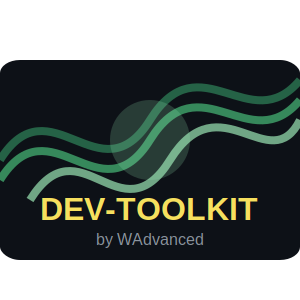

[](https://opensource.org/licenses/MIT)

<div align="center">
  <a href="#">
    
  </a>
</div>
<div>

# Dev Toolkit

A curated collection of documentation, code snippets, and other resources for software development.

---

## 📖 Overview

This repository is a centralized collection of common resources used across various software projects. It aims to streamline development by providing standardized templates, reusable code snippets, and helpful guides.

- **Key Resources**:
  - **AI Prompts**: Standardized prompts for interacting with AI models like Gemini.
  - **Code Snippets**: Reusable code for various languages and frameworks (e.g., Elixir).
  - **Documentation Templates**: Templates for common project documentation.

---

## 🚀 How to Use

The resources in this repository are meant to be copied and adapted for your own projects.

- **Cloning the repository:**
  ```bash
  git clone https://github.com/wadvanced/dev-toolkit.git
  cd dev-toolkit
  ```

You can then browse the directories to find the resources you need.

---

## 🤝 Contributing

Contributions are welcome! Please read our [Contributing Guidelines](./CONTRIBUTING.md) to get started.

---

## 📜 License

This project is licensed under the [MIT License](LICENSE).