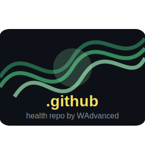

  

# .github

This repository serves as the central health repository for all projects under the @wadvanced organization on GitHub. It contains standardized documentation, templates, and configuration files to ensure consistency and quality across all our repositories.

---

## 📖 Overview

This repository is a centralized collection of common resources used across various software projects. It aims to streamline development by providing standardized templates, reusable code snippets, and helpful guides.

- **Key Resources**:
  - **AI Prompts**: Standardized prompts for interacting with AI models like Gemini.
  - **Code Snippets**: Reusable code for various languages and frameworks (e.g., Elixir).
  - **Documentation Templates**: Templates for common project documentation.

---

## 🚀 How to Use

This repository is not meant to be cloned directly. Instead, its contents are used by GitHub to provide default community health files for all repositories under the @wadvanced organization.

For more information, see the [GitHub documentation on creating a default community health file](https://docs.github.com/en/communities/setting-up-your-project-for-healthy-contributions/creating-a-default-community-health-file).

---

## 🤝 Contributing

Contributions are welcome! Please read our [Contributing Guidelines](./CONTRIBUTING.md) to get started.

---

## 📜 License

This project is licensed under the [MIT License](LICENSE).